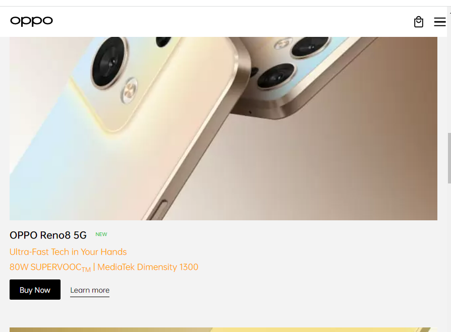

# JavaScript DOM Assignment 1

## About 

This project was a part of Full Stack JavaScript web developer course by iNeuron and team. The project was to edit elements, append and change the texts and images of other websites 

## What Did I Learn From This Project ?

This was my first project to change the elements of other websites. It was a nice experience and learnt to:
 
 - Find an element

 - To change the text and text color

 - To Set Attributes

 - To Create Elements

 - To append Tags and Attributes

#

## Project Topics

#

*1. Code to change the devto website title to change "iNeuron" and description to "I write Code".*

**Actual picture :**

**Changed picture:**

#

*2. To append a new box called "My FAQ" in youtubesupport*

**Actual picture :**

**Changed picture:**

#

*3. To change the text of "Buy Now" Button to "Check Out"*

**Actual picture :**

**Changed picture:**

#

*4. To change the heading description of hackerRank*

**Actual picture:**

**Changed picture:**

*5. To change the text direction of dell website from left to right*

**Actual picture:**

**Changed picture:**

#

*6. To change the button text to date 

**Actual picture:**

**Changed picture:**

#

*7. Extracting the canon logo source*

**Actual picture:**

**Changed picture:**

#

*8. Changing the mobile description color to orange*

**Actual picture:**

**Changed picture:**

